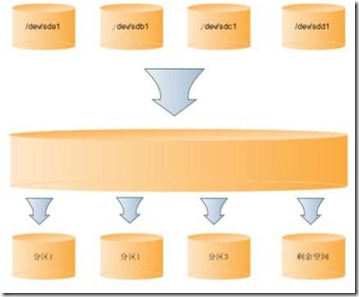

##### Linux LVM硬盘管理及LVM扩容

###### LVM简介

LVM是 Logical Volume Manager(逻辑卷管理)的简写，LVM将一个或多个硬盘的分区在逻辑上集合，相当于一个大硬盘来使用，当硬盘的空间不够使用的时候，可以继续将其它的硬盘的分区加入其中，这样可以实现磁盘空间的动态管理，相对于普通的磁盘分区有很大的灵活性。

与传统的磁盘与分区相比，LVM为计算机提供了更高层次的磁盘存储。它使系统管理员可以更方便的为应用与用户分配存储空间。

在LVM管理下的存储卷可以按需要随时改变大小与移除。LVM也允许按用户组对存储卷进行管理，允许管理员用更直观的名称(如"sales'、 'development')代替物理磁盘名(如'sda'、'sdb')来标识存储卷。



由四个磁盘分区可以组成一个很大的空间，然后在这些空间上划分一些逻辑分区，当一个逻辑分区的空间不够用的时候，可以从剩余空间上划分一些空间给空间不够用的分区使用。


###### LVM基本术语

LVM是在磁盘分区和文件系统之间添加的一个逻辑层，来为文件系统屏蔽下层磁盘分区布局，提供一个抽象的盘卷，在盘卷上建立文件系统。

> * 物理存储介质（The physical media）：这里指系统的存储设备：硬盘，如：/dev/hda1、/dev/sda等等，是存储系统最低层的存储单元。
> * 物理卷（physical volume）：物理卷就是指硬盘分区或从逻辑上与磁盘分区具有同样功能的设备(如RAID)，是LVM的基本存储逻辑块，但和基本的物理存储介质（如分区、磁盘等）比较，却包含有与LVM相关的管理参数。
> * 卷组（Volume Group）：LVM卷组类似于非LVM系统中的物理硬盘，其由物理卷组成。可以在卷组上创建一个或多个“LVM分区”（逻辑卷），LVM卷组由一个或多个物理卷组成。
> * 逻辑卷（logical volume）：LVM的逻辑卷类似于非LVM系统中的硬盘分区，在逻辑卷之上可以建立文件系统(比如/home或者/usr等)。
> * PE（physical extent）：每一个物理卷被划分为称为PE(Physical Extents)的基本单元，具有唯一编号的PE是可以被LVM寻址的最小单元。PE的大小是可配置的，默认为4MB。
> * LE（logical extent）：逻辑卷也被划分为被称为LE(Logical Extents) 的可被寻址的基本单位。在同一个卷组中，LE的大小和PE是相同的，并且一一对应。


> * PV:是物理的磁盘分区
> * VG:LVM中的物理的磁盘分区，也就是PV，必须加入VG，可以将VG理解为一个仓库或者是几个大的硬盘。
> * LV：也就是从VG中划分的逻辑分区

###### 安装LVM

加载device-mapper模块,从linux内核2.6.9开始，device-mapper模块就已经包含在内，所以你只需加载即可。

```shell
# 加载mapper模块：
modprobe dm_mod

# 查看是否已经加载：

lsmod | grep dm_mod
# 出现如下输出，即表示加载成功：

dm_mod                 63097  4 dm_mirror,dm_multipath,dm_raid45,dm_log
```

如果你的内核高于2.6.9却没有此模块，可以使用yum install device-mapper命令安装。
如果你的内核低于2.6.9，则需要编译安装device-mapper模块。
